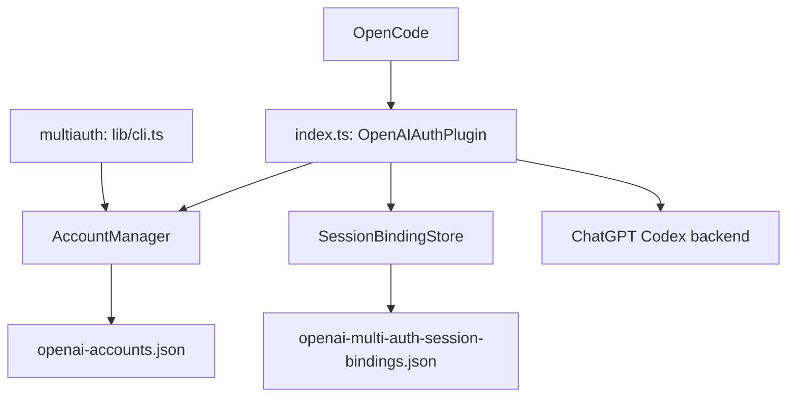
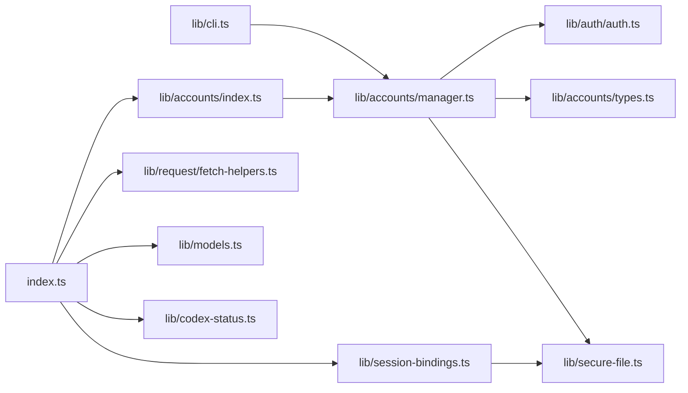
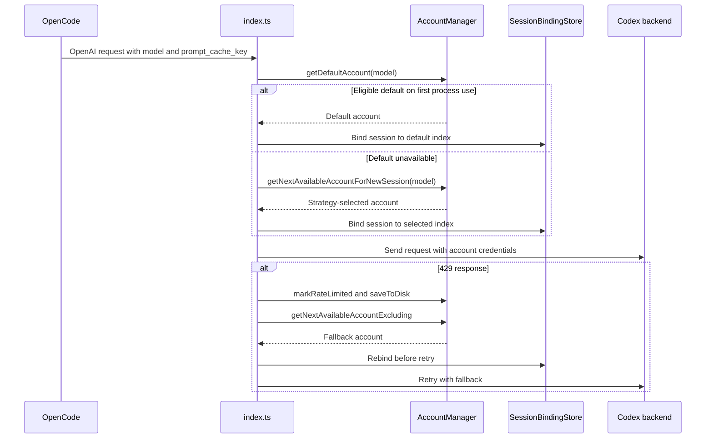

# Architecture

## System Overview

This OpenCode plugin authenticates against the ChatGPT Codex backend, selects among configured OpenAI accounts, and retries rate-limited requests with eligible fallback accounts.

## Module Dependencies

References flow from entry points to orchestration, then storage and utility layers. The default-account feature introduces no circular dependency.

## Entry Points

| Entry point | Location | Contract |
|---|---|---|
| OpenCode plugin | `index.ts:70` | Initializes account and session state and returns OpenCode hooks |
| OpenAI loader | `index.ts:330` | Returns the backend URL and custom fetch implementation |
| Request executor | `index.ts:351` | Refreshes tokens, sends requests, and handles account retries |
| Request selection | `index.ts:628` | Extracts model/session data and selects the working account |
| CLI API | `lib/cli.ts:17` | `runCli(args, io)` returns exit status `0` or `1` |
| CLI executable | `lib/cli.ts:64` | Runs `runCli()` when invoked directly |
| Package command | `package.json:39` | Maps `multiauth` to `dist/lib/cli.js` |

## Modified Data Flow

The first observable OpenAI request is the session initialization boundary because OpenCode exposes no `session.selected` hook. The process-local initialized-session set prevents a session from returning to its default after it has been rebound to a fallback.

## Interfaces and Contracts

| Interface | Location | Contract |
|---|---|---|
| `AccountsStorage.defaultAccountIndex` | `lib/accounts/types.ts:27` | Optional numeric index in the existing version-1 file |
| `AccountManager.getDefaultAccount()` | `lib/accounts/manager.ts:209` | Returns an eligible default or `null` |
| `AccountManager.getDefaultAccountIndex()` | `lib/accounts/manager.ts:217` | Distinguishes configured-but-unavailable from unconfigured |
| `AccountManager.setDefaultAccount()` | `lib/accounts/manager.ts:221` | Resolves exactly one trimmed, case-insensitive email and persists it |
| `SessionBindingStore.set()` | `lib/session-bindings.ts:47` | Persists a session key to account index binding |
| `runCli()` | `lib/cli.ts:17` | Writes user-safe output and returns a process exit code |

Existing version-1 account files without `defaultAccountIndex` remain valid. Invalid stored indexes are treated as no default. Removing the default clears it; removing an earlier account decrements it.

## Technical Debt

- The default and session bindings use positional account indexes rather than stable IDs. Manager-mediated removal maintains the default, while stale session bindings are repaired when encountered.
- The CLI cannot explicitly clear a default. Selecting another account replaces it, and removing the selected account clears it.
- `removeAccount()` starts persistence without awaiting completion, so callers cannot observe a write failure. This behavior predates the feature.
- Atomic rename protects individual JSON writes but does not prevent last-writer-wins races between a running plugin and the CLI.

No new TODO markers were introduced.
