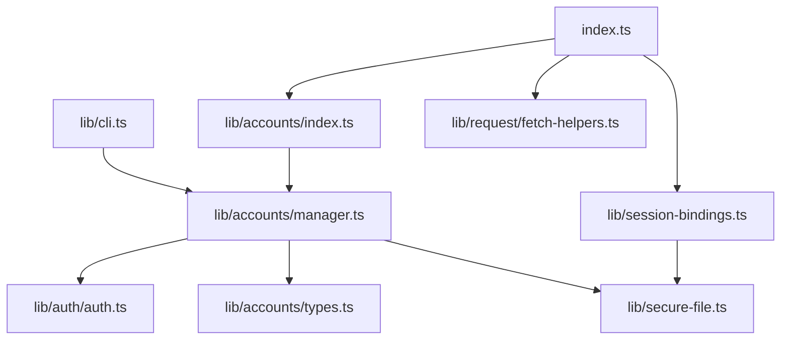
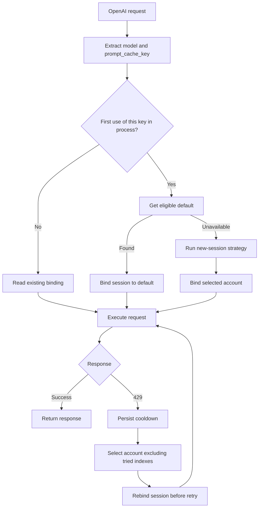

# Plugin Architecture & Technical Decisions

This document explains the technical design decisions, architecture, and implementation details of the OpenAI Codex OAuth plugin for OpenCode.

## Table of Contents
- [Architecture Overview](#architecture-overview)
- [Stateless vs Stateful Mode](#stateless-vs-stateful-mode)
- [Message ID Handling](#message-id-handling)
- [Reasoning Content Flow](#reasoning-content-flow)
- [Request Pipeline](#request-pipeline)
- [Comparison with Codex CLI](#comparison-with-codex-cli)
- [Design Rationale](#design-rationale)

---

## Architecture Overview

```
┌─────────────┐
│  OpenCode   │  TUI/Desktop client
└──────┬──────┘
       │
       │ streamText() with AI SDK
       │
       ▼
┌──────────────────────────────┐
│  OpenCode Provider System    │
│  - Loads plugin               │
│  - Calls plugin.auth.loader() │
│  - Passes provider config     │
└──────┬───────────────────────┘
       │
       │ Custom fetch()
       │
       ▼
┌──────────────────────────────┐
│  This Plugin                 │
│  - AccountManager            │
│  - Multi-account rotation    │
│  - OAuth authentication      │
│  - Request transformation    │
│  - store:false handling      │
│  - Codex bridge prompts      │
│  - Toast notifications       │
└──────┬───────────────────────┘
       │
       │ HTTP POST with OAuth
       │
       ▼
┌──────────────────────────────┐
│  OpenAI Codex API            │
│  (ChatGPT Backend)           │
│  - Requires OAuth            │
│  - Supports store:false      │
│  - Returns SSE stream        │
└──────────────────────────────┘
```

---

## Multi-Account System

### Module Responsibilities

| Module | Responsibility |
|---|---|
| `index.ts` | Plugin entry point, session-aware selection, and retry handling |
| `lib/cli.ts` | `multiauth` command-line entry point |
| `lib/accounts/manager.ts` | Account storage, default resolution, strategies, cooldowns, and token refresh |
| `lib/accounts/types.ts` | Account and storage contracts |
| `lib/session-bindings.ts` | Persistent session-key to account-index bindings |
| `lib/secure-file.ts` | Secure JSON persistence |



### Default and Fallback Flow



The first observable OpenAI request initializes a session because OpenCode exposes no `session.selected` hook. A process-local set ensures that a session rebound after a 429 does not immediately return to its default.

### Default Account Contract

`AccountManager.setDefaultAccount(email)` trims and compares email addresses case-insensitively, requires exactly one match, and persists the matching numeric account index. Unknown or ambiguous input does not modify storage.

`AccountManager.getDefaultAccount(model)` returns `null` when no default is configured or when the configured account is cooling down, has failed at least three times, or does not support the requested model.

### Account Storage Format

```json
{
  "version": 1,
  "accounts": [
    {
      "index": 0,
      "email": "user@example.com",
      "userId": "user-xxx",
      "accountId": "acct-xxx",
      "planType": "plus",
      "addedAt": 1705000000000,
      "lastUsed": 1705001000000,
      "parts": {
        "refreshToken": "..."
      },
      "access": "eyJ...",
      "expires": 1705003600000,
      "rateLimitResets": {
        "gpt-5.2-codex": 1705002000000
      },
      "globalRateLimitReset": null,
      "consecutiveFailures": 0
    }
  ],
  "activeAccountIndex": 0,
  "roundRobinCursor": 1,
  "defaultAccountIndex": 0
}
```

`defaultAccountIndex` is optional, so existing version-1 files remain valid. Removing the selected account clears the default; removing an earlier account decrements the index.

On a `429`, `executeRequest()` records and persists the cooldown before selecting another account. It updates the session binding before recursively retrying, keeping later requests on that fallback for the current process/session.

### Environment Variables

| Variable | Description | Default |
|----------|-------------|---------|
| `OPENCODE_OPENAI_QUIET` | Disable toast notifications | Off |
| `OPENCODE_OPENAI_DEBUG` | Enable debug logging | Off |
| `OPENCODE_OPENAI_STRATEGY` | `sticky`, `round-robin`, `hybrid` | `sticky` |
| `OPENCODE_OPENAI_PID_OFFSET` | PID-based account offset | Off |

---

## Stateless vs Stateful Mode

### Why store:false?

The plugin uses **`store: false`** (stateless mode) because:

1. **ChatGPT Backend Requirement** (confirmed via testing):
   ```json
   // Attempt with store:true → 400 Bad Request
   {"detail":"Store must be set to false"}
   ```

2. **Codex CLI Behavior** (`tmp/codex/codex-rs/core/src/client.rs:215-232`):
   ```rust
   // Codex CLI uses store:false for ChatGPT OAuth
   let azure_workaround = self.provider.is_azure_responses_endpoint();
   store: azure_workaround,  // false for ChatGPT, true for Azure
   ```

**Key Points**:
1. ✅ **ChatGPT backend REQUIRES store:false** (not optional)
2. ✅ **Codex CLI uses store:false for ChatGPT**
3. ✅ **Azure requires store:true** (different endpoint, not supported by this plugin)
4. ✅ **Stateless mode = no server-side conversation storage**

### How Context Works with store:false

**Question**: If there's no server storage, how does the LLM remember previous turns?

**Answer**: Full message history is sent in every request:

```typescript
// Turn 3 request contains ALL previous messages:
input: [
  { role: "developer", content: "..." },      // System prompts
  { role: "user", content: "write test.txt" },     // Turn 1 user
  { type: "function_call", name: "write", ... },   // Turn 1 tool call
  { type: "function_call_output", ... },           // Turn 1 tool result
  { role: "assistant", content: "Done!" },         // Turn 1 response
  { role: "user", content: "read it" },            // Turn 2 user
  { type: "function_call", name: "read", ... },    // Turn 2 tool call
  { type: "function_call_output", ... },           // Turn 2 tool result
  { role: "assistant", content: "Contents..." },   // Turn 2 response
  { role: "user", content: "what did you write?" } // Turn 3 user (current)
]
// All IDs stripped, item_reference filtered out
```

**Context is maintained through**:
- ✅ Full message history (LLM sees all previous messages)
- ✅ Full tool call history (LLM sees what it did)
- ✅ `reasoning.encrypted_content` (preserves reasoning between turns)

**Source**: Verified via `ENABLE_PLUGIN_REQUEST_LOGGING=1` logs

### Store Comparison

| Aspect | store:false (This Plugin) | store:true (Azure Only) |
|--------|---------------------------|-------------------------|
| **ChatGPT Support** | ✅ Required | ❌ Rejected by API |
| **Message History** | ✅ Sent in each request (no IDs) | Stored on server |
| **Message IDs** | ❌ Must strip all | ✅ Required |
| **AI SDK Compat** | ❌ Must filter `item_reference` | ✅ Works natively |
| **Context** | Full history + encrypted reasoning | Server-stored conversation |
| **Codex CLI Parity** | ✅ Perfect match | ❌ Different mode |

**Decision**: Use **`store:false`** (only option for ChatGPT backend).

---

## Message ID Handling & AI SDK Compatibility

### The Problem

**OpenCode/AI SDK sends two incompatible constructs**:
```typescript
// Multi-turn request from OpenCode
const body = {
  input: [
    { type: "message", role: "developer", content: [...] },
    { type: "message", role: "user", content: [...], id: "msg_abc" },
    { type: "item_reference", id: "rs_xyz" },  // ← AI SDK construct
    { type: "function_call", id: "fc_123" }
  ]
};
```

**Two issues**:
1. `item_reference` - AI SDK construct for server state lookup (not in Codex API spec)
2. Message IDs - Cause "item not found" with `store: false`

**ChatGPT Backend Requirement** (confirmed via testing):
```json
{"detail":"Store must be set to false"}
```

**Errors that occurred**:
```
❌ "Item with id 'msg_abc' not found. Items are not persisted when `store` is set to false."
❌ "Missing required parameter: 'input[3].id'" (when item_reference has no ID)
```

### The Solution

**Filter AI SDK Constructs + Strip IDs** (`lib/request/request-transformer.ts:114-135`):
```typescript
export function filterInput(input: InputItem[]): InputItem[] {
  return input
    .filter((item) => {
      // Remove AI SDK constructs not supported by Codex API
      if (item.type === "item_reference") {
        return false;  // AI SDK only - references server state
      }
      return true;  // Keep all other items
    })
    .map((item) => {
      // Strip IDs from all items (stateless mode)
      if (item.id) {
        const { id, ...itemWithoutId } = item;
        return itemWithoutId as InputItem;
      }
      return item;
    });
}
```

**Why this approach?**
1. ✅ **Filter `item_reference`** - Not in Codex API, AI SDK-only construct
2. ✅ **Keep all messages** - LLM needs full conversation history for context
3. ✅ **Strip ALL IDs** - Matches Codex CLI stateless behavior
4. ✅ **Future-proof** - No ID pattern matching, handles any ID format

### Debug Logging

The plugin logs ID filtering for debugging:

```typescript
// Before filtering
console.log(`[openai-codex-plugin] Filtering ${originalIds.length} message IDs from input:`, originalIds);

// After filtering
console.log(`[openai-codex-plugin] Successfully removed all ${originalIds.length} message IDs`);

// Or warning if IDs remain
console.warn(`[openai-codex-plugin] WARNING: ${remainingIds.length} IDs still present after filtering:`, remainingIds);
```

**Source**: `lib/request/request-transformer.ts:287-301`

---

## Reasoning Content Flow

### Context Preservation Without Storage

**Challenge**: How to maintain context across turns when `store:false` means no server-side storage?

**Solution**: Use `reasoning.encrypted_content`

```typescript
body.include = modelConfig.include || ["reasoning.encrypted_content"];
```

**How it works**:
1. **Turn 1**: Model generates reasoning, encrypted content returned
2. **Client**: Stores encrypted content locally
3. **Turn 2**: Client sends encrypted content back in request
4. **Server**: Decrypts content to restore reasoning context
5. **Model**: Has full context without server-side storage

**Flow Diagram**:
```
Turn 1:
Client → [Request without IDs] → Server
         Server → [Response + encrypted reasoning] → Client
         Client stores encrypted content locally

Turn 2:
Client → [Request with encrypted content, no IDs] → Server
         Server decrypts reasoning context
         Server → [Response + new encrypted reasoning] → Client
```

**Codex CLI equivalent** (`tmp/codex/codex-rs/core/src/client.rs:190-194`):
```rust
let include: Vec<String> = if reasoning.is_some() {
    vec!["reasoning.encrypted_content".to_string()]
} else {
    vec![]
};
```

**Source**: `lib/request/request-transformer.ts:303`

---

## Request Pipeline

### Transformation Steps

```
1. Original OpenCode Request
   ├─ model: "gpt-5-codex"
   ├─ input: [{ id: "msg_123", ... }, { id: "rs_456", ... }]
   └─ tools: [...]

2. Model Normalization
   ├─ Detect codex/gpt-5/codex-mini variants
   └─ Normalize to "gpt-5", "gpt-5-codex", or "codex-mini-latest"

3. Config Merging
   ├─ Global options (provider.openai.options)
   ├─ Model-specific options (provider.openai.models[name].options)
   └─ Result: merged config for this model

4. Message ID Filtering
   ├─ Remove ALL IDs from input array
   ├─ Log original IDs for debugging
   └─ Verify no IDs remain

5. System Prompt Handling (CODEX_MODE)
   ├─ Filter out OpenCode system prompts
   ├─ Preserve OpenCode env + AGENTS instructions when concatenated
   └─ Add Codex-OpenCode bridge prompt

6. Orphan Tool Output Handling
   ├─ Match function_call_output to function_call OR local_shell_call
   ├─ Match custom_tool_call_output to custom_tool_call
   └─ Convert unmatched outputs to assistant messages (preserve context)

7. Reasoning Configuration
   ├─ Set reasoningEffort (minimal/low/medium/high)
   ├─ Set reasoningSummary (auto/detailed)
   └─ Based on model variant

8. Prompt Caching & Session Headers
   ├─ Preserve host-supplied prompt_cache_key (OpenCode session id)
   ├─ Add conversation + account headers for Codex debugging when cache key exists
   └─ Leave headers unset if host does not provide a cache key

9. Final Body
   ├─ store: false
   ├─ stream: true
   ├─ instructions: Codex system prompt
   ├─ input: Filtered messages (no IDs)
   ├─ reasoning: { effort, summary }
   ├─ text: { verbosity }
   ├─ include: ["reasoning.encrypted_content"]
   └─ prompt_cache_key: conversation-scoped UUID
```

**Source**: `lib/request/request-transformer.ts:265-329`

---

## Comparison with Codex CLI

### What We Match

| Feature | Codex CLI | This Plugin | Match? |
|---------|-----------|-------------|--------|
| **OAuth Flow** | ✅ PKCE + ChatGPT login | ✅ Same | ✅ |
| **store Parameter** | `false` (ChatGPT) | `false` | ✅ |
| **Message IDs** | Stripped in stateless | Stripped | ✅ |
| **reasoning.encrypted_content** | ✅ Included | ✅ Included | ✅ |
| **Model Normalization** | "gpt-5" / "gpt-5-codex" / "codex-mini-latest" | Same | ✅ |
| **Reasoning Effort** | medium (default) | medium (default) | ✅ |
| **Text Verbosity** | medium (codex), low (gpt-5) | Same | ✅ |

### What We Add

| Feature | Codex CLI | This Plugin | Why? |
|---------|-----------|-------------|------|
| **Codex-OpenCode Bridge** | N/A (native) | ✅ Custom prompt | OpenCode → Codex translation |
| **OpenCode Prompt Filtering** | N/A | ✅ Filter & replace | Remove OpenCode prompts, keep env/AGENTS |
| **Orphan Tool Output Handling** | ✅ Drop orphans | ✅ Convert to messages | Preserve context + avoid 400s |
| **Usage-limit messaging** | CLI prints status | ✅ Friendly error summary | Surface 5h/weekly windows in OpenCode |
| **Per-Model Options** | CLI flags | ✅ Config file | Better UX in OpenCode |
| **Custom Model Names** | No | ✅ Display names | UI convenience |

---

## Design Rationale

### Why Not store:true?

**Pros of store:true**:
- ✅ No ID filtering needed
- ✅ Server manages conversation
- ✅ Potentially more robust

**Cons of store:true**:
- ❌ Diverges from Codex CLI behavior
- ❌ Requires conversation ID management
- ❌ More complex error handling
- ❌ Unknown server-side storage limits

**Decision**: Use `store:false` for Codex parity and simplicity.

### Why Complete ID Removal?

**Alternative**: Filter specific ID patterns (`rs_*`, `msg_*`, etc.)

**Problem**:
- ID patterns may change
- New ID types could be added
- Partial filtering is brittle

**Solution**: Remove **ALL** IDs

**Rationale**:
- Matches Codex CLI behavior exactly
- Future-proof against ID format changes
- Simpler implementation (no pattern matching)
- Clearer semantics (stateless = no IDs)

### Why Codex-OpenCode Bridge?

**Problem**: OpenCode's system prompts are optimized for OpenCode's tool set and behavior patterns.

**Solution**: Replace OpenCode prompts with Codex-specific instructions.

**Benefits**:
- ✅ Explains tool name differences (apply_patch → edit)
- ✅ Documents available tools
- ✅ Maintains OpenCode working style
- ✅ Preserves Codex best practices
- ✅ 90% reduction in prompt tokens

**Source**: `lib/prompts/codex-opencode-bridge.ts`

### Why Per-Model Config Options?

**Alternative**: Single global config

**Problem**:
- `gpt-5-codex` optimal settings differ from `gpt-5-nano`
- Users want quick switching between quality levels
- No way to save "presets"

**Solution**: Per-model options in config

**Benefits**:
- ✅ Save multiple configurations
- ✅ Quick switching (no CLI args)
- ✅ Descriptive names ("Fast", "Balanced", "Max Quality")
- ✅ Persistent across sessions

**Source**: `config/opencode-legacy.json` (legacy) or `config/opencode-modern.json` (variants)

---

## Error Handling

### Common Errors

#### 1. "Item with id 'X' not found"
**Cause**: Message ID leaked through filtering
**Fix**: Improved `filterInput()` removes ALL IDs
**Prevention**: Debug logging catches remaining IDs

#### 2. Token Expiration
**Cause**: OAuth access token expired
**Fix**: `shouldRefreshToken()` checks expiration
**Prevention**: Auto-refresh before requests

#### 3. "store: false" Validation Error (Azure)
**Cause**: Azure doesn't support stateless mode
**Workaround**: Codex CLI uses `store: true` for Azure only
**This Plugin**: Only supports ChatGPT OAuth (no Azure)

---

## Performance Considerations

### Token Usage

**Codex Bridge Prompt**: ~550 tokens (~90% reduction vs full OpenCode prompt)
**Benefit**: Faster inference, lower costs

### Request Optimization

**Prompt Caching**: Uses `promptCacheKey` for session-based caching
**Result**: Reduced token usage on subsequent turns

**Source**: `tmp/opencode/packages/opencode/src/provider/transform.ts:90-92`

---

## Future Improvements

### Potential Enhancements

1. **Azure Support**: Add `store: true` mode with ID management
2. **Version Detection**: Adapt to OpenCode/AI SDK version changes
3. **Config Validation**: Warn about unsupported options
4. **Test Coverage**: Unit tests for all transformation functions
5. **Performance Metrics**: Log token usage and latency

### Breaking Changes to Watch

1. **AI SDK Updates**: Changes to `.responses()` method
2. **OpenCode Changes**: New message ID formats
3. **Codex API Changes**: New request parameters

---

## See Also
- [CONFIG_FLOW.md](./CONFIG_FLOW.md) - Configuration system guide
- [Codex CLI Source](https://github.com/openai/codex) - Official implementation
- [OpenCode Source](https://github.com/sst/opencode) - OpenCode implementation
